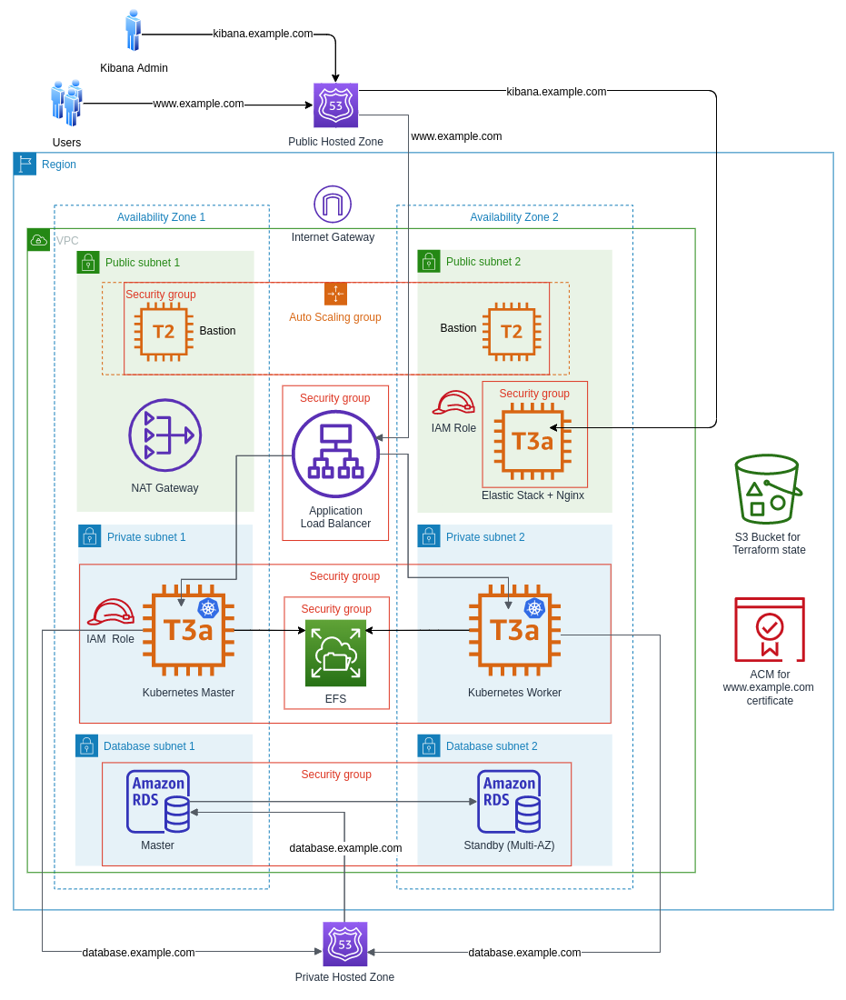

# Owncloud on Kubernetes
Deployed on AWS using Terraform and Ansible

>A domain is required.

<p align="center">
  
</p>

## How to setup:

>Installation steps for Ubuntu 18.04 LTS.

- Install python.
- Install terraform (Tested with v1.0.7).

```
curl "https://releases.hashicorp.com/terraform/1.0.7/terraform_1.0.7_linux_amd64.zip" -o "terraform_1.0.7_linux_amd64.zip"

unzip terraform_1.0.7_linux_amd64.zip

sudo mv terraform /usr/local/bin/
```

- Create an IAM user with AdministratorAccess.
- Install AWS CLI.

```
curl "https://awscli.amazonaws.com/awscli-exe-linux-x86_64.zip" -o "awscliv2.zip"

unzip awscliv2.zip

sudo ./aws/install

aws configure
```

- Install ansible (Tested with v2.9.24).

```
sudo apt update

sudo apt install software-properties-common

sudo add-apt-repository --yes --update ppa:ansible/ansible

sudo apt install ansible=2.9.24-1ppa~bionic
```

- Generate an ssh-key and give it to the ssh-agent.

```
ssh-keygen -t rsa -b 4096

eval `ssh-agent`

ssh-add /path/to/the/private/key

# To confirm:
ssh-add -l
```

- Create a reusable Route 53 delegation set. (Note down the delegation set id & the name servers)

```
aws route53 create-reusable-delegation-set --caller-reference <enter-unique-string> 
```

```
# Example output:

{
    "Location": "https://route53.amazonaws.com/2013-04-01/delegationset/ABCD1234EFGH5678",
    "DelegationSet": {
        "Id": "/delegationset/ABCD1234EFGH5678",
        "CallerReference": "1234",
        "NameServers": [
            "ns-123.awsdns-45.com",
            "ns-678.awsdns-90.net",
            "ns-2814.awsdns-39.co.uk",
            "ns-1246.awsdns-75.org"
        ]
    }
}
```

- Put the name servers in the settings of your Domain Name provider.
- Now, clone this repository.
```
git clone https://github.com/ankit-jethi/owncloud-kubernetes.git

cd owncloud-kubernetes/
```
- For terraform variables: Refer to [variables.tf](../master/terraform/variables.tf) and [example.tfvars](../master/terraform/example.tfvars) and create **terraform.tfvars** in the terraform directory.
- Create an S3 bucket to store terraform state. Put the S3 bucket details in [backend.conf](../master/terraform/backend.conf).
- For ansible variables: Edit [all.yml](../master/group_vars/all.yml) in group_vars directory (Some variables are managed by terraform).
>For SSL/TLS certificates, by default, staging environment will be selected for Let's Encrypt. This is recommended to avoid hitting rate limits. Once deployed and verified, you can switch to the production environment by following the steps mentioned in the [Switching to production environment of Let's Encrypt section](##switching-to-production-environment-of-lets-encrypt).

Now run these commands:  
- To install required ansible collections and roles.
```
ansible-galaxy install -r requirements.yml
```
- To initialize terraform backend and providers.
```
cd terraform/

terraform init -backend-config=backend.conf
```  
- To create an execution plan.
```
terraform plan
```  
- To execute the plan and create the infrastructure.
```
terraform apply
```

Now, wait for 20-30 minutes for the whole infrastructure to be set up.

Then access Owncloud at https://your-domain.com and Kibana at https://kibana.your-domain.com

## Switching to production environment of Let's Encrypt:

>Run these commands only after deploying and verifying using staging environment.

- Edit [all.yml](../master/group_vars/all.yml) in group_vars directory:
```
# Change the values of these variables as mentioned below:

kibana_test_certificate: false
kibana_certificate_force_renewal: true

owncloud_test_certificate: false
owncloud_certificate_force_renewal: true
```
- Now run this command from the same directory as [site.yml](../master/site.yml):
```
ansible-playbook --inventory aws_inventory --skip-tags "always" --tags "kibana-ssl-setup,owncloud-ssl-setup" --verbose site.yml
```

## Cleaning up:

- Delete the infrastructure
```
terraform destroy
```
- Delete the S3 bucket containing the terraform state.
- Delete the ACM certificate for owncloud application.

